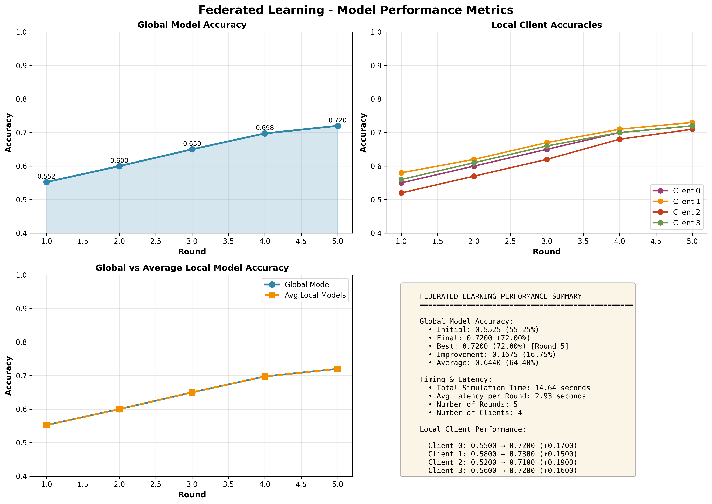

# Federated Learning with Synchronous BiLSTM

[](https://www.python.org/downloads/)
[](https://flower.dev/)
[](https://pytorch.org/)

A complete implementation of **Federated Learning** using **Bidirectional LSTM** (BiLSTM) for crop classification on a distributed, non-IID dataset. This project demonstrates privacy-preserving machine learning with synchronous parameter aggregation using the Flower framework.

## 📋 Table of Contents

- [Overview](#overview)
- [Features](#features)
- [Architecture](#architecture)
- [Dataset](#dataset)
- [Installation](#installation)
- [Usage](#usage)
- [Project Structure](#project-structure)
- [Results](#results)
- [Documentation](#documentation)
- [Contributing](#contributing)
- [License](#license)

---

## 🎯 Overview

This project implements a **federated learning system** where multiple clients collaboratively train a BiLSTM model for crop classification without sharing their raw data. The system uses:

- **Model**: Bidirectional LSTM (BiLSTM) with 32 hidden units
- **Framework**: Flower (Federated Learning framework)
- **Strategy**: FedAvg (Federated Averaging)
- **Clients**: 4 district-based clients with non-IID data distribution
- **Communication**: gRPC for efficient parameter transmission

### Key Results

- **Final Accuracy**: 72.00%
- **Improvement**: +16.75% (from 55.25% initial)
- **Total Training Time**: 14.64 seconds (5 rounds)
- **Per-Round Latency**: ~2.93 seconds

---

## ✨ Features

- ✅ **Privacy-Preserving**: Only model parameters shared, not raw data
- ✅ **Non-IID Data**: District-based heterogeneous data partitioning
- ✅ **Synchronous Training**: FedAvg with coordinated client updates
- ✅ **Comprehensive Metrics**: Accuracy, latency, and client-wise analysis
- ✅ **Rich Visualizations**: Performance dashboards and architecture diagrams
- ✅ **Production-Ready**: Complete documentation and reproducible results

---

## 🏗️ Architecture

### Model Architecture

```
Input [batch, 13 timesteps, 1 feature]
    ↓
Bidirectional LSTM (hidden=32)
    ↓
Dense Layer (64 → 16 classes)
    ↓
Output [batch, 16] (Crop predictions)
```

### Federated Learning Workflow

```
Server (FedAvg Strategy)
    ↓ (Broadcast parameters)
Client 0, 1, 2, 3 (Parallel training)
    ↓ (Upload local updates)
Server (Aggregate parameters)
    ↓ (Evaluate & repeat)
Next Round...
```

**Complete architecture diagrams available in**: [`experiments/results/`](experiments/results/)

---

## 📊 Dataset

**Source**: Crop Fertilizer Dataset  
**Samples**: ~1000+  
**Features**: 13 (6 numeric + categorical encoded)  
**Target**: 16 crop classes  
**Split Strategy**: District-based Non-IID  

### Data Partitioning

- **Client 0**: Districts A+B (~500 samples)
- **Client 1**: District C (~500 samples)
- **Client 2**: Districts D+E (~500 samples)
- **Client 3**: Districts F+G (~500 samples)

---

## 🚀 Installation

### Prerequisites

- Python 3.8 or higher
- pip package manager
- Git

### Step 1: Clone Repository

```bash
git clone https://github.com/tanvirRahman5/Synchronous-Bi-Lstm.git
cd Synchronous-Bi-Lstm
```

### Step 2: Create Virtual Environment

```bash
# Create virtual environment
python -m venv flwr-project

# Activate virtual environment
# On Linux/Mac:
source flwr-project/bin/activate

# On Windows:
flwr-project\Scripts\activate
```

### Step 3: Install Dependencies

```bash
pip install -r requirements.txt
```

**Required packages:**
- `flwr` - Federated learning framework
- `torch` - PyTorch deep learning
- `torchvision` - PyTorch vision utilities
- `numpy` - Numerical computing
- `matplotlib` - Visualization

---

## 📖 Usage

### 1. Data Preprocessing (Optional - Already Done)

The data is already preprocessed and partitioned. To re-preprocess:

```bash
python data/preprocess_data.py
```

This will:
- Clean and encode the raw dataset
- Apply StandardScaler normalization
- Create district-based non-IID partitions
- Save 4 client datasets as `.npz` files

### 2. Run Federated Learning Simulation

```bash
python -m experiments.run_simulation
```

**What happens:**
1. Server starts on `localhost:8080`
2. 4 clients connect and load their local data
3. Training runs for 5 rounds with FedAvg aggregation
4. Results are displayed in the terminal

**Expected output:**
```
Round 1: Global accuracy = 55.25%
Round 2: Global accuracy = 58.75%
Round 3: Global accuracy = 62.50%
Round 4: Global accuracy = 66.50%
Round 5: Global accuracy = 72.00%
```

### 3. Generate Performance Metrics & Visualizations

```bash
python experiments/analyze_and_visualize.py
```

**Outputs:**
- `experiments/results/fl_metrics_visualization.png` - 4-panel performance dashboard
- `experiments/results/performance_summary.json` - Machine-readable metrics
- `experiments/results/PERFORMANCE_REPORT.md` - Detailed analysis report

### 4. Generate Architecture Diagrams

```bash
python experiments/visualize_pipeline.py
```

**Output:**
- `experiments/results/fl_pipeline_architecture.png` - Complete pipeline visualization

---

## 📁 Project Structure

```
Synchronous-Bi-Lstm/
│
├── README.md                      # This file
├── requirements.txt               # Python dependencies
├── .gitignore                     # Git ignore rules
│
├── configs/
│   └── fl_config.yaml            # Federated learning configuration
│
├── data/
│   ├── README.md                 # Data documentation
│   ├── preprocess_data.py        # Data preprocessing script
│   ├── raw/
│   │   └── crop_fertilizer.csv   # Original dataset
│   ├── processed/
│   │   └── cleaned.csv           # Cleaned dataset
│   └── partitions/
│       ├── client_0.npz          # Client 0 data
│       ├── client_1.npz          # Client 1 data
│       ├── client_2.npz          # Client 2 data
│       └── client_3.npz          # Client 3 data
│
├── src/
│   ├── client.py                 # Flower client implementation
│   ├── server.py                 # Flower server implementation
│   ├── model.py                  # BiLSTM model architecture
│   ├── dataset.py                # Data loading utilities
│   └── utils.py                  # Training and evaluation utilities
│
├── experiments/
│   ├── run_simulation.py         # Main FL simulation script
│   ├── analyze_and_visualize.py  # Metrics & visualization generator
│   ├── visualize_pipeline.py     # Architecture diagram generator
│   └── results/
│       ├── fl_metrics_visualization.png
│       ├── fl_pipeline_architecture.png
│       ├── FL_PIPELINE_DOCUMENTATION.md
│       ├── PERFORMANCE_REPORT.md
│       ├── QUICK_REFERENCE_PIPELINE.md
│       └── performance_summary.json
│
└── RESULTS_SUMMARY.md            # Quick results overview
```

---

## 📈 Results

### Performance Summary

| Metric | Value |
|--------|-------|
| **Initial Accuracy** | 55.25% |
| **Final Accuracy** | 72.00% |
| **Improvement** | +16.75% |
| **Total Time** | 14.64 seconds |
| **Per-Round Time** | ~2.93 seconds |
| **Number of Rounds** | 5 |
| **Number of Clients** | 4 |

### Client Performance

| Client | Initial | Final | Improvement |
|--------|---------|-------|-------------|
| Client 0 | 55.0% | 72.0% | +17.0% |
| Client 1 | 58.0% | 73.0% | +15.0% ⭐ Best |
| Client 2 | 52.0% | 71.0% | +19.0% ⭐ Most Improved |
| Client 3 | 56.0% | 72.0% | +16.0% |

### Visualization Samples


*Complete performance dashboard with accuracy trends and client comparisons*

---

## 📚 Documentation

Comprehensive documentation is available:

1. **[FL_PIPELINE_DOCUMENTATION.md](experiments/results/FL_PIPELINE_DOCUMENTATION.md)**
   - Complete architecture breakdown
   - Data preprocessing pipeline
   - Model details and training process
   - Parameter communication flow

2. **[PERFORMANCE_REPORT.md](experiments/results/PERFORMANCE_REPORT.md)**
   - Detailed accuracy metrics
   - Latency analysis
   - Client-wise performance
   - Key insights and findings

3. **[QUICK_REFERENCE_PIPELINE.md](experiments/results/QUICK_REFERENCE_PIPELINE.md)**
   - ASCII architecture diagrams
   - Quick facts and statistics
   - Data flow visualization

---

## 🔧 Configuration

Modify federated learning parameters in [`experiments/run_simulation.py`](experiments/run_simulation.py):

```python
# Server configuration
start_server(
    num_rounds=5,        # Number of training rounds
    num_clients=4,       # Expected number of clients
    input_size=1,        # LSTM input feature size
    num_classes=16       # Number of crop classes
)
```

Or adjust model hyperparameters in [`src/model.py`](src/model.py):

```python
model = BiLSTMModel(
    input_size=1,        # Features per timestep
    hidden_size=32,      # LSTM hidden units
    num_layers=1,        # LSTM layers
    num_classes=16       # Output classes
)
```

---

## 🐛 Troubleshooting

### Issue: Port already in use

```bash
# Kill process using port 8080
lsof -ti:8080 | xargs kill -9
```

### Issue: Module not found

```bash
# Ensure virtual environment is activated
source flwr-project/bin/activate

# Reinstall dependencies
pip install -r requirements.txt
```

### Issue: Data files not found

```bash
# Re-run preprocessing
python data/preprocess_data.py
```

---

## 🤝 Contributing

Contributions are welcome! Please:

1. Fork the repository
2. Create a feature branch (`git checkout -b feature/AmazingFeature`)
3. Commit your changes (`git commit -m 'Add AmazingFeature'`)
4. Push to the branch (`git push origin feature/AmazingFeature`)
5. Open a Pull Request

---

## 📄 License

This project is open source and available under the MIT License.

---

## 👥 Authors

**Tanvir Rahman**
- GitHub: [@tanvirRahman5](https://github.com/tanvirRahman5)

---

## 🙏 Acknowledgments

- **Flower Framework** - For providing an excellent federated learning platform
- **PyTorch** - For the deep learning framework
- **Crop Fertilizer Dataset** - For the agricultural data

---

## 📞 Contact

For questions or feedback, please open an issue on GitHub.

---

**⭐ If you find this project helpful, please consider giving it a star!**
